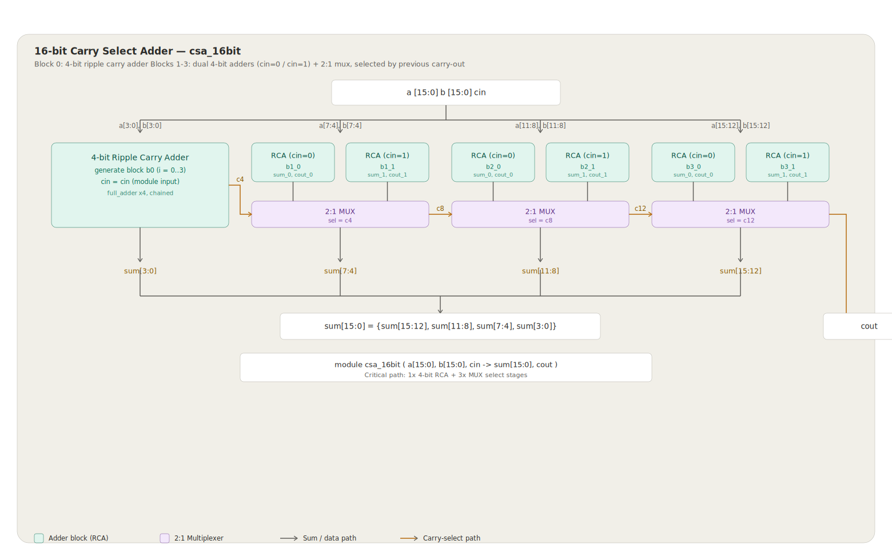
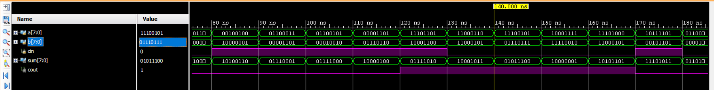
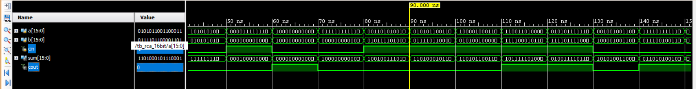
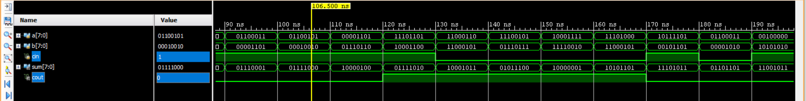
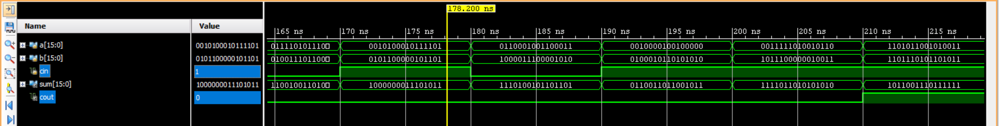
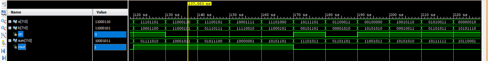
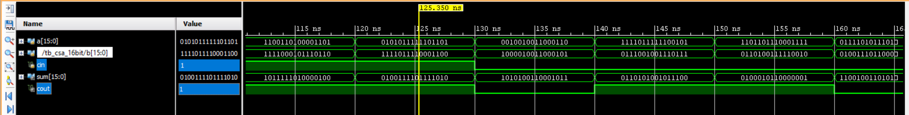

# Timing and Area Trade-off Analysis of Adder Architectures

This project implements and benchmarks **8-bit** and **16-bit** Ripple Carry Adders (RCA), Carry Lookahead Adders (CLA), and Carry Select Adders (CSLA) using synthesizable Verilog HDL. The designs are evaluated through logic synthesis and Static Timing Analysis (STA) to compare propagation delay, logic utilization, and overall area–performance trade-offs under identical FPGA implementation constraints.

---

# Top-Level Architecture



---

# Project Overview

Adder architecture plays a critical role in determining the speed and hardware cost of digital systems. While Ripple Carry Adders provide a compact implementation, advanced architectures such as Carry Lookahead and Carry Select improve computational speed at the expense of additional hardware resources.

This project presents structural RTL implementations of six adder configurations (8-bit and 16-bit RCA, CLA, and CSLA), followed by logic synthesis and Static Timing Analysis to evaluate their timing behavior and FPGA resource utilization.

---

# Key Highlights

- Designed synthesizable structural Verilog RTL implementations of RCA, CLA, and CSLA architectures.
- Implemented both **8-bit** and **16-bit** versions for comparative evaluation.
- Verified functionality using dedicated self-checking Verilog testbenches.
- Performed logic synthesis and Static Timing Analysis (STA).
- Benchmarked propagation delay, LUT utilization, and timing slack across all implementations.
- Identified the optimal balance between hardware utilization and timing performance.

---

# Implemented Architectures

| Architecture | Description |
|--------------|-------------|
| **Ripple Carry Adder (RCA)** | Cascaded Full Adders where carry propagates sequentially through every stage, resulting in linear delay growth. |
| **Carry Lookahead Adder (CLA)** | Uses Generate and Propagate logic to compute carries in parallel, significantly reducing propagation delay. |
| **Carry Select Adder (CSLA)** | Computes addition simultaneously for both carry possibilities and selects the correct output through multiplexers, improving overall performance. |

---

# Design Flow

```text
RTL Design
      │
      ▼
Functional Verification
      │
      ▼
Logic Synthesis
      │
      ▼
Static Timing Analysis
      │
      ▼
Performance Comparison
```

---

# Simulation Results

### Ripple Carry Adder(8bit)

### Ripple Carry Adder(16bit)

### Carry LookAhead Adder(8bit)

### Carry LookAhead Adder(16bit)

### Carry Select Adder(8bit)

### Carry Select Adder(16 bit)


---

# Performance Comparison

| Architecture | Width | LUTs | Critical Path Delay (ns) | Worst Negative Slack (ns) |
|--------------|------:|----:|-------------------------:|--------------------------:|
| RCA | 8-bit | 17 | 7.810 | +2.190 |
| CLA | 8-bit | 21 | 8.214 | +3.786 |
| CSLA | 8-bit | 24 | 8.852 | +3.148 |
| RCA | 16-bit | 32 | 9.974 | +0.026 |
| CLA | 16-bit | 46 | 7.882 | +2.118 |
| **CSLA** | **16-bit** | **34** | **8.941** | **+1.059** |

---

# Key Observations

- **CLA (16-bit)** achieved approximately **21% lower propagation delay** than the corresponding Ripple Carry Adder.
- **CSLA (16-bit)** provided the best overall area–speed trade-off with only **34 LUTs** while maintaining a critical-path delay of **8.941 ns**.
- Ripple Carry Adders remained the most hardware-efficient architecture but exhibited the longest propagation delay due to serial carry propagation.
- Static Timing Analysis confirmed positive timing slack for all synthesized implementations at a **100 MHz** target clock.

---

# Verification Methodology

- Directed and self-checking Verilog testbenches.
- Boundary-value and overflow-condition verification.
- Randomized operand generation.
- Functional correctness verified against behavioral reference models.
- Waveform inspection performed using GTKWave and Vivado Waveform Viewer.

---

# Tools Used

- **Verilog HDL**
- **AMD Vivado Design Suite 2023.2**
- **Vivado Simulator**
- **Icarus Verilog**
- **GTKWave**
- **Static Timing Analysis (STA)**

---

# Repository Structure

```text
Timing-and-Area-Trade-off-Analysis-of-Adder-Architectures
│
├── LICENSE
├── README.md
├── images/
│   └── adder_architecture.svg
│
├── rtl/
│
├── tb/
│
├── synthesis/
│
├── sta/
│
└── waveforms/
```

---

# Project Outcomes

- Developed six synthesizable structural RTL implementations of industry-standard adder architectures.
- Quantified the timing and hardware trade-offs between RCA, CLA, and CSLA implementations.
- Demonstrated a **21% timing improvement** of CLA over RCA for 16-bit implementations.
- Identified **CSLA (16-bit)** as the optimal architecture considering both area utilization and propagation delay.
- Established a reusable verification and benchmarking framework for digital arithmetic circuits.

---

# Author

**Samarpan Acharya**

B.Tech • Electronics and Communication Engineering

National Institute of Technology Rourkela

---

## License

This project is licensed under the **MIT License**.

---

> **Note:** This repository demonstrates practical RTL design, logic synthesis, functional verification, and Static Timing Analysis of commonly used adder architectures for digital VLSI applications.
